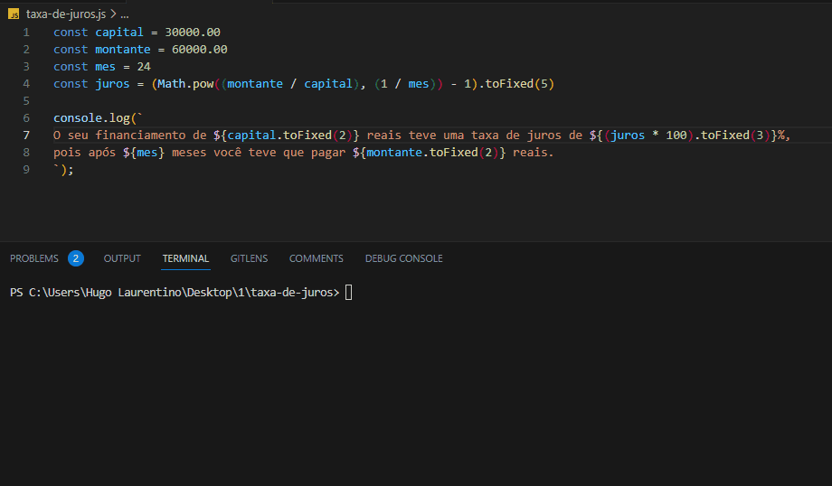

<h1 align="center">
  
</h1>

- [x] Bak-End
- [x] Criar Título
- [x] Criar Descrição
- [x] Sobre
- [x] Tecnologia
- [x] Pre requisito
- [x] Autor
- [x] GIF‘s
---
<h1 align='center'>Taxa de Juros</h1>

<p align='center'>Esse é um exemplo de lógica em javascript</p>
<p align='center'>
   Faça um programa que calcula a taxa de juros que foi operada sobre um financiamento a partir do montate total que foi pago, do capital inicial que foi obtido como empréstimo e do tempo decorrido do financiamento.

A fórmula (e um exemplo) que calcula essa taxa segue abaixo:

$$ i = \left( \frac{M}{C} \right)^\frac{1}{n} - 1 $$

onde:

**i:** taxa de juros \
**M:** montante \
**C:** capital inicial (valor de dinheiro inicial) \
**n:** número de meses
</p>

<p align='center'>
	<a href='#sobre'>Sobre</a> |
	<a href='#pré-requisitos'>Pre Requisitos</a> |
	<a href='#tecnologias'>Tecnologias</a> |
	<a href='#autor'>Autor</a>
</p>

---
<h1 align='center'>
	
</h1>

---
### Sobre
  <p align= 'justify'>
Uma pessoa pegou emprestado R$ 30.000,00 e após 24 meses tenha pago R$ 60.000,00 para encerrar sua dívida. Qual a taxa de juros mensal desse empréstimo?

Do enunciado acima temos:

**M:** 60000 \
**C:** 30000 \
**n:** 24

$$ i = \frac{60000}{30000}^\frac{1}{24} - 1 $$

$$ i = 0,02930 $$

$$ i = 2,930% ao mês $$

Imprima a taxa de juros com uma mensagem seguindo o formato a seguir (substituindo C, i, M e n por números):

"O seu financiamento de 30000 reais teve uma taxa de juros de 2,930%, pois após 24 meses você teve que pagar 60000 reais."
  </p>


---
### Pré-requisitos 

Antes de começar, você vai precisar ter instalado em sua máquina as seguintes FERRAMENTAS: [GIT](https://git-scm.com/), [Node.js](https://nodejs.org/en/download). 
Além disto é bom ter um editor para trabalhar com o código como [VSCode](https://code.visualstudio.com/download).

### 🎲 Rodando o Back End

```bash
# Clone este repositório
$ git clone https://github.com/hugolaurentino/taxa-de-juros.git

# Acesse a pasta do projeto no terminal/cmd
$ cd taxa-de-juros

# Instale as dependências
$ npm install

# Execute 
$ node .\taxa-de-juros.js

```
### Tecnologias 

As seguintes ferramentas foram usadas na construção do projeto:

- [Node.js][nodejs]
---

###### tags: `lógica` `matemática` `nodeJS`

## Autor

Feito com ❤️ por Hugo Laurentino 👋🏽 [Entre em contato!](https://www.linkedin.com/in/hugo-laurentino-silva/)

[nodejs]: https://nodejs.org/

